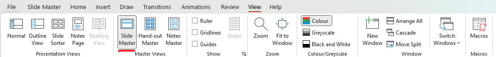
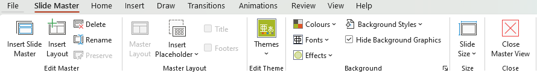
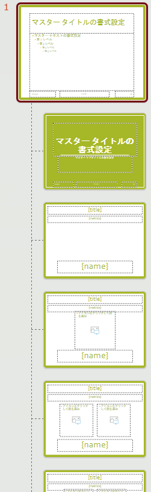
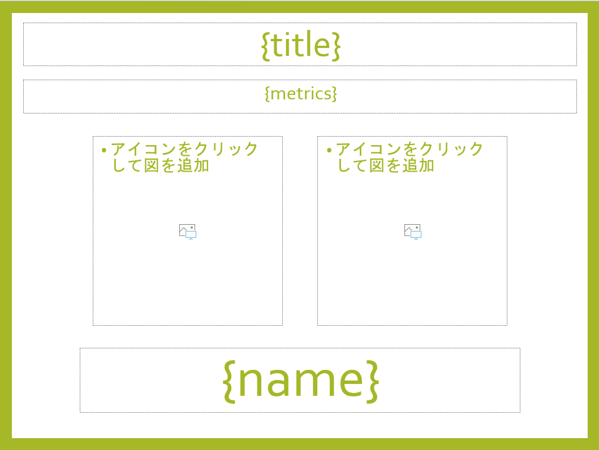

# Tab-Slides

Developed by Satoshi Inoue (UTDS junior)

## What does this program do?

This program automatically creates ranking slides (`nth Best Adjudicator`, `nth Best Speaker`, `nth Best Team`, `nth Breaking Team`, etc.) by using information pasted from Tabbycat.

## Getting Started

### PowerPoint Template

In order to create ranking slides, you must create a template slide that decides the design of the slide itself. A template should have 4 crucial elements:

-   **Title**: The name of achievement, such as `Open 3rd Best Speaker`
-   **Metrics**: The metrics used to calculate the rank, such as `7 points, avg. 156 pts`
-   **Name**: The name of the team, speaker, adjudicator being awarded
-   **Institutional Logos**

Here are the instructions:

1. Open Microsoft Powerpoint, prepare a slide template

Convert it into a template. Go to [this site](https://support.microsoft.com/en-us/office/create-and-save-a-powerpoint-template-ee4429ad-2a74-4100-82f7-50f8169c8aca) for more details.

2. On the **View** tab, in the **Master Views** group, choose **Slide Master**. A Slide master is basically a group of layouts.

3. On the **Slide Master** tab, choose **Insert Layout** and create layouts under the slide master. Change the name of the layout to make it easier to know which one later by choosing **Rename**. You should prepare at least four slides, each able to contain 0, 1, 2, and 3 institution logos.

For text that will be replaced later by team names, etc., make sure to create the placeholder by selecting **Insert Placeholder**. Use **Text Placeholders** for texts and **Picture placeholders** for institutional logos.

For **Text placeholders**, change the text inside the placeholder to the following:

-   `{title}` for the name of the achievement, such as `Open 3rd Best Speaker`
-   `{metrics}` for showing the metrics used for the ranking, such as `7 points, avg. 156 pts`
-   `{name}` for showing the name of team, speaker or adjudicator.

### Using Python
