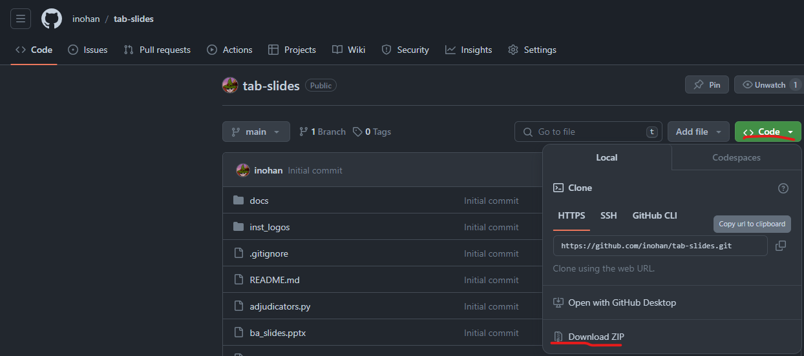

# Tab-Slides

Developed by Satoshi Inoue (UTDS junior)

## What does this program do?

This program automatically creates ranking slides (`nth Best Adjudicator`, `nth Best Speaker`, `nth Best Team`, `nth Breaking Team`, etc.) by using information pasted from Tabbycat.

## Getting Started

### PowerPoint Template

In order to create ranking slides, you must create a template slide that decides the design of the slide itself. A template should have 4 crucial elements:

-   **Title**: The name of achievement, such as `Open 3rd Best Speaker`
-   **Metrics**: The metrics used to calculate the rank, such as `7 points, avg. 156 pts`
-   **Name**: The name of the team, speaker, adjudicator being awarded
-   **Institutional Logos**

Here are the instructions:

1. Open Microsoft Powerpoint, prepare a slide template

Convert it into a template. Go to [this site](https://support.microsoft.com/en-us/office/create-and-save-a-powerpoint-template-ee4429ad-2a74-4100-82f7-50f8169c8aca) for more details.

2. On the **View** tab, in the **Master Views** group, choose **Slide Master**. A Slide master is basically a group of layouts.


3. On the **Slide Master** tab, choose **Insert Layout** and create layouts under the slide master. Change the name of the layout to make it easier to know which one later by choosing **Rename**. You should prepare at least four slides, each able to contain 0, 1, 2, and 3 institution logos.


For text that will be replaced later by team names, etc., make sure to create the placeholder by selecting **Insert Placeholder**. Use **Text Placeholders** for texts and **Picture placeholders** for institutional logos.

For **Text placeholders**, change the text inside the placeholder to the following:

-   `{title}` for the name of the achievement, such as `Open 3rd Best Speaker`
-   `{metrics}` for showing the metrics used for the ranking, such as `7 points, avg. 156 pts`
-   `{name}` for showing the name of team, speaker or adjudicator.


### Importing data

#### Importing participants

On Tabbycat's **Participants** page or **Administrator area** > **Setup** > **Participants**, there are two copy buttons that should say **Copy table data to clipboard in a CSV format**.


The left button should copy **adjudicator information** on clipboard, and the right one should copy **team / debater information**.

Open Microsoft Excel (or any apps that can create `.csv` files), **paste** the content copied, and **save it as a `.csv` file**. Save the adjudicator info and debater info into a different file, such as `participant_debaters.csv` and `participant_adjudicator.csv`.


**Adjudicators**

For adjudicators, the following columns must exist for the program to work correctly: `name` and `institution`. Any other columns (`adjcore` and `independent`) are unnecessary but can be included.

**Teams / debaters**

For teams and debaters, columns `name`, `team` and `institution` must exist. However, `institution` may not exist by default when you paste it, so you must add a column having institution for each debater.


#### Importing logos

The institutional logos for some institutions are loaded by default in the file `inst_logos`. The list of names that are loaded by default is in `institution_logo.csv`. For example, the name `Tokyo` or `UTDS` both load `inst_logos/Tokyo.png`.

If there are some institutions that are not in the list that you need, put the logo of the institution in the `inst_logos` folder, and add the institution name, as well as the path (`./inst_logos/<name of the picture>`) to `institution_logo.csv`.

#### Importing team standings / results

The information on team standings can be found in Tabbycat in **Administrator area** > **Standings** > **All Teams** (or **Open Teams**, etc.). On the right of the `Find in Table` search bar, click the copy button.

Open Excel, paste the copied information, and **save it as a `.csv` file**, similar to what you did in [Importing participants](#importing-participants).

Additionally, you will need to add another column for the award ranking (the column name can be mostly anything, such as `open_break`, `rank`, etc.). However, avoid using the `Rk` column used by Tabbycat directly. Also, do not put equal marks for tied rankings. Only enter the rankings for teams you want to show up in the slides (e.g. if you want to show until 8th best team / break, enter `1`~`8`, leave others empty).

For reserved breaks, use negative numbers (`-1` refers to reserved 1st, etc.).


#### Importing debater standings / results

The process is very similar to [importing team standings](#importing-team-standings--results). However, instead of importing team standings, you must import speaker standings from **Administrator area** > **Standings** > **All Speakers** on Tabbycat. Make sure to add an additional column showing the prize rank (`prize` in the example below).


#### Importing judge standings / results

The process is very similar to [importing team standings](#importing-team-standings--results). However, instead of importing team standings, you must import speaker standings from **Administrator area** > **Feedback** > **Overview** on Tabbycat. Make sure to add an additional column showing the prize rank (`prize` in the example below).


### Starting the program

1. [Install python](https://www.python.org/downloads/).
2. Open command terminal. On Windows, type in `cmd` in the search bar. On mac, there should be an app named **Terminal**.
3. Download this program. On Github, you can download from **Code** > **Download ZIP** and unpack it.
   
   Another way, if you have git installed, is to run on command terminal

```sh
git clone https://github.com/inohan/tab-slides.git
```

4. Open the file and copy the file path (url). Open **command terminal** (search for `cmd` or `terminal`), and enter the following line, where `<DIR>` is the url of the folder (for example, `\home\inohaan\projects\tab-slides`).

```sh
cd <DIR>
```

5. Check if you have installed python correctly.

**For macOS / Unix**

```sh
python3 --version
python3 -m pip --version
```

**For Windows**

```sh
py --version
py -m pip --version
```

You should get something like `Python 3.11.5` and `pip 23.2.1`.
If such messages are not shown, [troubleshoot](https://packaging.python.org/en/latest/tutorials/installing-packages/).

6. Set up an virtual environment.

**For macOS / Unix**

```sh
python3 -m venv venv
source venv/bin/activate
```

**For Windows**

```sh
py -m venv venv
.\venv\Scripts\activate
```

You should see `(venv)` before what you enter.

7. Install all dependencies.

**For macOS / Unix**

```sh
python3 -m pip install -r requirements.txt
```

**For Windows**

```sh
py -m pip install -r requirements.txt
```

8. When installation is done, start the program.

**For macOS / Unix**

```sh
python3 ./main.py
```

**For Windows**

```sh
py .\main.py
```

9. When done, deactivate virtual environment. When using it for the second time, you can skip 4~7.

```sh
deactivate
```

## Program settings

When you run the program successfully, a list of options will show up.

```
[?] Select which slide to create:
   Team Slides
   Speaker Slides
   Adjudicator Slides
 > Quit
```

Select the slide type you want to create.

A text like this should show up (differs depending on what you choose).

```
[?] Configure:
   Participant: NOT LOADED
   Logo: ./institution_logo.csv
   Standing: NOT LOADED
   Presentation: NOT LOADED
   Title: "(nth) Breaking Team" / "(nth) Reserved Breaking Team"
   Metrics display
   Danger prevention: Change of rankings
   Create slide
 > Quit
```

Below are the descriptions for each of the settings.

### Participant (mandatory, all settings)

[The `.csv` file you created](#importing-participants) containing the information about participant (either debater/team or adjudicator)

### Logo (has default, all settings)

[The `.csv` file](#importing-logos) containing information about institutional logos. By default, loads `institution_logo.csv`.

### Standings (mandatory, all settings)

The `.csv` file you created containing the information about standings.

After selecting the csv file, you will be prompted to select the column that holds the rank (`open_break` or `rookie_break` in [this case](#importing-team-standings--results)).

```
[?] Which column holds the rank?:
 > Rk
   team
   categories
   R1
   R2
   R3
   open_break
   rookie_break
```

Then, you will be asked to set the [metrics](#powerpoint-template) for team and speaker standings. You may always want to show some metrics such as wins, points, or average total speaker score, while you may only want to show some metrics such as standard deviation when needed for a tiebreaker. This option lets you choose this.

In order to know which metrics are used to calculate the ranking, go to Tabbycat **Administrator area** > **Setup** > **Configuration** > **Standings**. The **Team standing precedence** section has all the metrics used to calculate the rank, in order of priority.


For example, you may want to always show **Points** and **Average total speaker score** on the slide, but **Draw strength by wins** only when necessary.
**Note**: **Team standings extra metrics** are metrics that are not used, so do not include them.

```
[?] Select all metrics to always show: :
   Pts (Points)
   DS (Draw strength by wins)
   SSSD (Speaker score standard deviation)
   ATSS (Average total speaker score)
 > (Next)
```

First, enter all the metrics to always show, in order of priority (choose `Pts` first, then `ATSS` in the example above). Choose `(next)` when you've chosen all metrics to always show.

Then, choose all metrics to show only when necessary (choose `DS` in the example above but not `SSSD` because standard deviation is not used to calculate the actual rank). Choose `(next)` when you've chosen all metrics to show when necessary.

### Presentation (mandatory, all settings)

[The presentation](#powerpoint-template) containing the slide layout and master.

After selecting the presentation file, you will be prompted to select the slide layout for 0~3 institutional logos.

```
[?] Select slide for 0 institutions:
 > [0] タイトル スライド
   [1] zero institution
   [2] single institution
   [3] double institution
   [4] triple institution
```

Select the appropriate slide layout. It is recommended to [change the slide layout name](#powerpoint-template) to make it easier to know which one is which.

### Title (optional, all settings)

The [title](#powerpoint-template) of the achievement. Depending on the prize / break, you may want the slide to say `Open nth Break`, `nth Rookie Best Speaker` etc., and you can adjust this. Replace the place where the number is going to be with `(nth)` when entering. For team slides, you can configure the title display for reserved teams.

### Metrics display (optional, only for team and speaker slides)

The setting for how to display the [metrics](#standings-mandatory-all-settings) such as wins, etc. For example, for points, you may want to display as `{} points` or `{} pts.`, where `{}` is the actual point. For total scores, you may want to display as `total {} spks` or `{} points total`. You can change the settings.

```
[?] Which display to change?:
   Number of seconds (2nds): "{} seconds"
   Number of thirds (3rds): "{} thirds"
   Number of times in pullup debates (SPu): "{} pullups"
   Number of times ironed (Irons): "{} irons"
   Points (Pts): "{} points"
   Speaker score standard deviation (SSD): "stdev. {}"
   Sum of margins (Marg): "margin {}"
   Total speaker score (Spk): "{} spks"
   Votes/ballots carried (Ballots): "{} ballots"
   Who-beat-whom (WBW1): "who-beat-whom"
   Wins (Wins): "{} wins"
   Reset
 > Back
```

### Danger Prevention (optional, all)

The setting for danger prevention slides (the slide between the team names, only showing the title and the metric).

-   `None`: no danger prevention
-   `All`: prevention slide for every award, including same rankings
-   `Change of rankings`: make prevention slide only when ranking change, and not when there are 2+ speakers with the same rank.

### Create slide

Creates the actual slide. You will then be asked to choose the file location to save.
